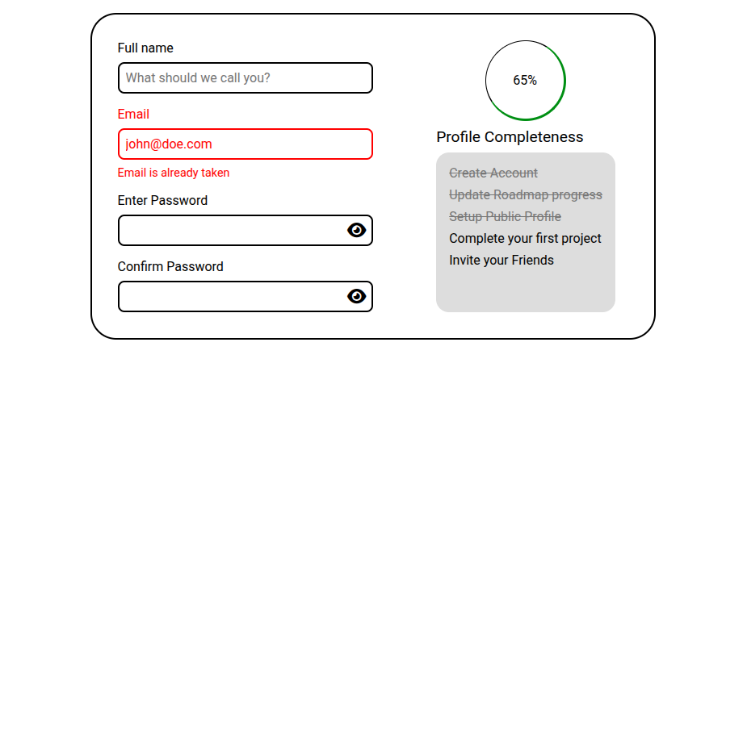

# Accessible Form UI

https://roadmap.sh/projects/accessible-form-ui

An accessible form UI designed using HTML and CSS.

The form includes input fields, error messages, and a password toggle feature.

## Preview

